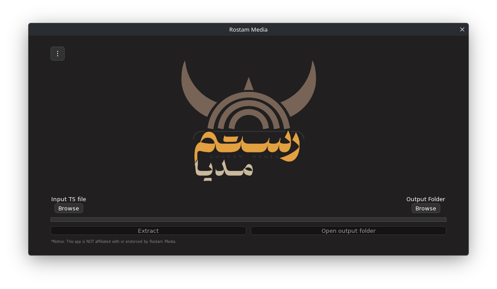

</img>

[فارسی](README_PER.md)

## Unofficial Rostam Media client.

Rostam Media is a way of downloading content like files and videos from satelite TVs. It provides a one-way Internet by integrating data inside ts packets. For extracring the data, you need to record the data from satelite TV in ts format and extract from the ts file using the extractor software on your computer. Rostam Media's client (EQSat GUI) is only available on Windows. So I made this client for other platforms in C++.

## Screenshot

## Installing

You can download the AppImage from the "Releases" page.

## NOTICE
#### This app is unofficial. This software is NOT affiliated with or endorsed by Rostam Media.

Made with love. ❤️
