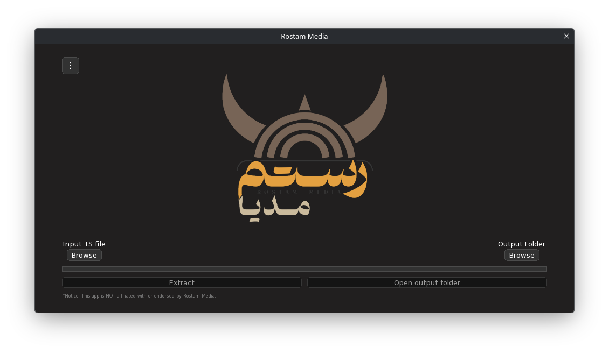

</img>

[English](README.md)

## نسخه‌ی غیر رسمی کلاینت رستم مدیا

رستم مدیا راهی برای دانلود محتوا از راه رسیور های ماهواره‌ایه. رستم مدیا یک اینترنت یک طرفه رو از طریق جاساز کردن اطلاعات داخل بسته های تی‌اس منتقل میکنه. برای استخراج اطلاعات شما باید از شبکه‌ی ماهواره‌ای رستم مدیا به مدت حدود چهار ساعت ضبط کنید. سپس با برنامه استخراج از فایل تی‌اس محتوا رو استخراج کنید. نسخه رسمی رستم مدیا فعلا تنها روی ویندوز 10 به بالا کار میکنه. این کلاینت برای بقیه ی سکوها با زبان سی‌پلاس‌پلاس نوشته شده. 

این برنامه، ویندوز 7 به بالا و لینوکس رو پشتیبانی می‌کنه.

## نماگرفت

## نصب

### 🐧 لینوکس

وارد رلیز ها بشید و آخرین نسخه‌ی اپ‌امیج رو دانلود کنید

### 🪟 ویندوز (7 به بالا)

وارد رلیز ها بشید و آخرین ستاپ ویندوز رو دانلود کنید

## تذکر

#### این برنامه یک نسخه‌ی غیر رسمی بوده و هیچ ارتباطی با رستم مدیا ندارد.

`☕🧑‍💻🍕`
